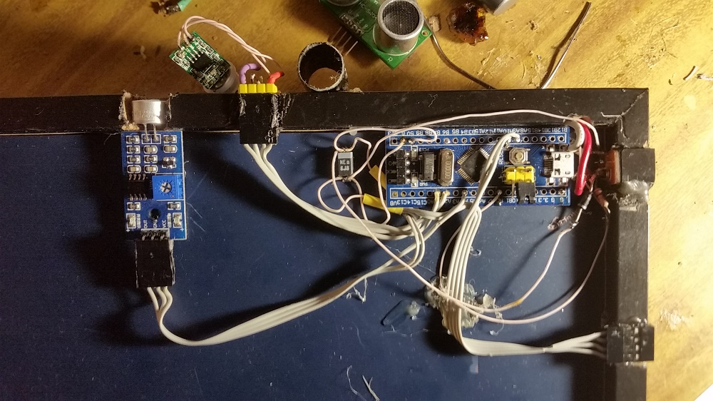
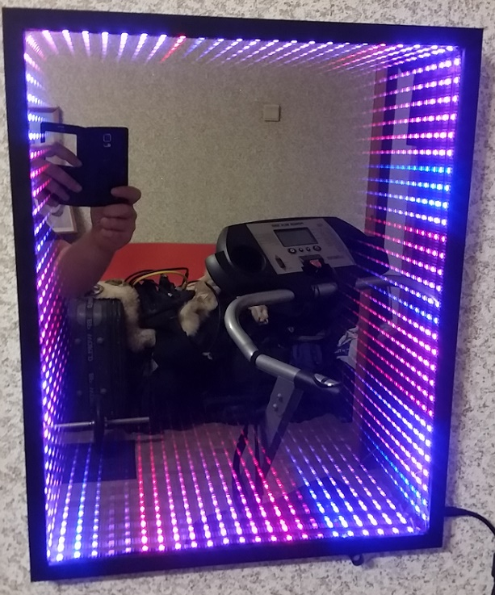

	STM32F103C8T6 LED ws2812b controller for infinity mirror.

support:
 1. HC-SR04 Ultrasonic Range Sensor (triger & echo signals prosessing by the STM32F103 base TIMer)
 2. FFT audio signal processing (ADC DMA & Interrupt)
 3. URART debug function set (USART_DBG_putc, USART_DBG_puts, USART_DBG_hexDump,USART_DBG_printf(const char* str, ...))

Windows gcc for stm32F103: 
 1. download https://drive.google.com/open?id=0B3hH5_ZXlbvwS000U0dhZnl2cGc
 2. unzip in any place 
 3. "./make.cmd D:\xxx\watering_ctrl all"

                                                
                                                
                                             
